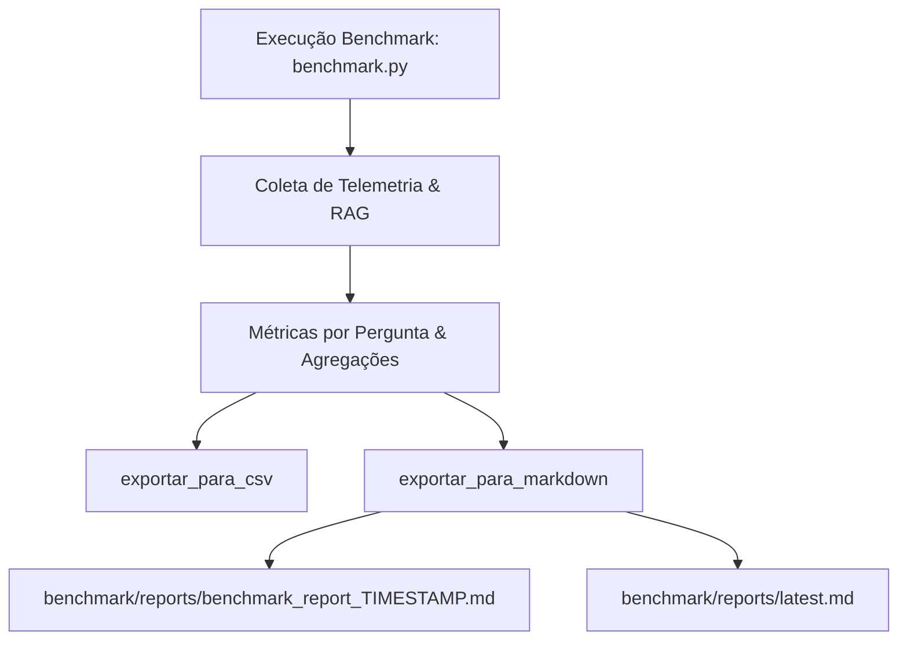

# Benchmark Markdown Reports Design

**Spec**: `.specs/features/benchmark-markdown-reports/spec.md`
**Status**: Approved

---

## Architecture Overview

A arquitetura desacopla a orquestração do benchmark técnico da formatação e persistência dos relatórios analíticos em Markdown:



A cada execução, o módulo calcula os destaques de performance, formata as tabelas e blocos colapsáveis em Markdown puro e salva um arquivo único persistente com timestamp, garantindo que nenhum histórico anterior seja sobrescrito.

---

## Code Reuse Analysis

### Existing Components to Leverage

| Component | Location | How to Use |
| --------- | -------- | ---------- |
| `obter_metricas_memoria` | `src/memory.py` | Coleta de telemetria de RAM e VRAM em tempo real |
| `limpar_memoria_gpu` | `src/memory.py` | Gestão de ciclo de vida da GPU e descarregamento entre modelos |
| `DEFAULT_EMBEDDING_MODEL`, `DEFAULT_CHROMA_DIR`, `DEFAULT_KEEP_ALIVE` | `src/config.py` | Metadados do ambiente RAG |
| `TrendRetriever`, `TrendBot` | `src/retriever.py`, `src/bot.py` | Execução de inferência e recuperação vetorial MMR |
| `exportar_para_csv` | `benchmark/benchmark.py` | Mantido para compatibilidade retroativa com planilhas |

### Integration Points

| System | Integration Method |
| ------ | ------------------ |
| `benchmark/benchmark.py` | Chamada direta de `exportar_para_markdown` no encerramento de `executar_benchmark_tecnico` |
| File System (`benchmark/reports/`) | Criação automática do diretório via `os.makedirs(..., exist_ok=True)` e gravação com codificação `utf-8` |

---

## Components

### `exportar_para_markdown`

- **Purpose**: Gera e salva o relatório estruturado em Markdown com timestamp único e atualiza o ponteiro `latest.md`.
- **Location**: `benchmark/benchmark.py`
- **Signature**:
  ```python
  def exportar_para_markdown(
      metadados_execucao: Dict[str, Any],
      resumo_modelos: List[Dict[str, Any]],
      todos_resultados: List[Dict[str, Any]],
      diretorio_relatorios: str = "reports"
  ) -> str:
      """Gera o arquivo benchmark_report_TIMESTAMP.md e atualiza latest.md."""
  ```
- **Dependencies**: `os`, `datetime`, `sys`, `platform`
- **Reuses**: Formato de dicionário de métricas já produzido pelo loop de benchmark.

### `gerar_conteudo_markdown`

- **Purpose**: Monta a string em sintaxe Markdown com cabeçalho, resumo consolidado, destaques de performance e detalhamento por pergunta com `<details>` colapsáveis.
- **Location**: `benchmark/benchmark.py`
- **Signature**:
  ```python
  def gerar_conteudo_markdown(
      metadados_execucao: Dict[str, Any],
      resumo_modelos: List[Dict[str, Any]],
      todos_resultados: List[Dict[str, Any]]
  ) -> str:
  ```

---

## Error Handling Strategy

| Error Scenario | Handling | User Impact |
| -------------- | -------- | ----------- |
| Falha ao recuperar contexto do ChromaDB | Trata a exceção e insere `"Erro ao recuperar contexto."` no bloco | Relatório é gerado normalmente sem travar |
| Falha na inferência do LLM (timeout / Ollama down) | Registra o erro no status da pergunta e no bloco de resposta | Relatório registra o erro e prossegue para as demais perguntas |
| Falha de I/O ao gravar arquivo Markdown | Captura `IOError`, exibe mensagem no terminal e não impede a exportação do CSV | Usuário é alertado no console |

---

## Risks & Concerns

| Concern | Location (file:line) | Impact | Mitigation |
| ------- | -------------------- | ------ | ---------- |
| Caracteres especiais e tags HTML no texto do contexto | `benchmark/benchmark.py` | Pode quebrar renderização do bloco `<details>` | Escape seguro ou formatação em bloco de citação Markdown delimitado |

---

## Tech Decisions

| Decision | Choice | Rationale |
| -------- | ------ | --------- |
| Persistência sem sobrescrita | Nomes com timestamp em microssegundos / segundos (`YYYYMMDD_HHMMSS`) | Atende ao requisito estrito de histórico permanente e imutável |
| Ponteiro de último relatório | Escrita simultânea em `latest.md` | Facilita a consulta do último benchmark sem necessidade de buscar no histórico |
