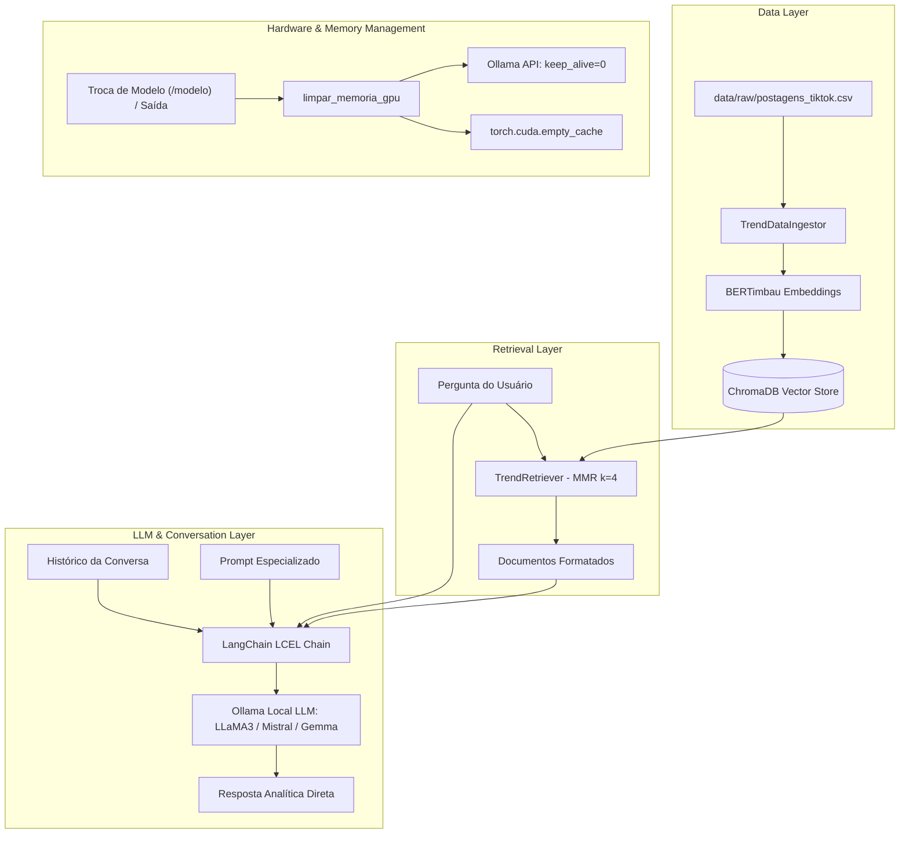

# Core RAG Assistant Design

**Spec**: `.specs/features/core-rag-assistant/spec.md`  
**Status**: Approved  

---

## Architecture Overview

O **TrendBot-BR** adota uma arquitetura modular RAG (Retrieval-Augmented Generation) desacoplada em 5 camadas principais:
1. **Ingestão & ETL**: Extração, limpeza e chunking de postagens do TikTok a partir de CSV bruto.
2. **Indexação & Embeddings**: Geração de representações vetoriais com BERTimbau (`neuralmind/bert-base-portuguese-cased`) e persistência no ChromaDB.
3. **Recuperação Semântica**: Busca com diversidade via MMR (*Maximal Marginal Relevance*) com filtragem opcional por metadados.
4. **Orquestração LLM**: Cadeia LCEL (LangChain Expression Language) integrando prompt contextualizado com LLMs locais via Ollama.
5. **Gestão de Hardware & Memória**: Desalocação ativa de VRAM (GPU NVIDIA) e coleta de métricas de RAM/VRAM.



---

## Code Reuse Analysis

### Existing Components to Leverage

| Component | Location | How to Use |
| --------- | -------- | ---------- |
| `TrendDataIngestor` | [src/ingestor.py](file:///home/renan/LSI/Trend-Bot/src/ingestor.py) | Responsável por carregar dados do CSV, chunking recursivo e indexação vetorial no ChromaDB |
| `TrendRetriever` | [src/retriever.py](file:///home/renan/LSI/Trend-Bot/src/retriever.py) | Abstrai a interface com o ChromaDB expondo método `get_retriever(k, hashtag_filter)` com busca MMR |
| `TrendBot` | [src/bot.py](file:///home/renan/LSI/Trend-Bot/src/bot.py) | Controla o loop de conversação, histórico em memória, chaining LCEL e troca de modelo em tempo de execução via `trocar_modelo(novo_modelo)` |
| `limpar_memoria_gpu` | [src/memory.py](file:///home/renan/LSI/Trend-Bot/src/memory.py) | Libera VRAM da GPU via Ollama `/api/generate` (keep_alive: 0), `/api/ps`, coleta de lixo Python e `torch.cuda.empty_cache()` |
| `obter_metricas_memoria` | [src/memory.py](file:///home/renan/LSI/Trend-Bot/src/memory.py) | Mede consumo em GB de RAM (`/proc/meminfo` ou `GlobalMemoryStatusEx`) e VRAM (`nvidia-smi`) |
| `benchmark_modelos` | [benchmark/benchmark.py](file:///home/renan/LSI/Trend-Bot/benchmark/benchmark.py) | Avalia latência de inferência e alocação de memória para bateria de perguntas padronizadas |

### Integration Points

| System | Integration Method |
| ------ | ------------------ |
| Ollama HTTP Server | Comunicação via `langchain_ollama` / `langchain_community` em `http://localhost:11434` |
| ChromaDB Local | Persistência embarcada baseada em arquivos SQLite/parquet em `data/chroma_db/` |
| HuggingFace Transformers / PyTorch | Carregamento local do modelo BERTimbau com fallback automático entre CUDA e CPU |

---

## Components

### 1. TrendDataIngestor
- **Purpose**: Realizar ETL de postagens, chunking de texto e persistência de embeddings no ChromaDB.
- **Location**: [src/ingestor.py](file:///home/renan/LSI/Trend-Bot/src/ingestor.py)
- **Interfaces**:
  - `load_and_index(): Chroma` - Executa a leitura do CSV, formata metadados, divide em splits e salva no banco vetorial.
- **Dependencies**: `pandas`, `langchain_text_splitters`, `langchain_huggingface` / `langchain_community`, `torch`
- **Reuses**: Configurações centrais de paths e chunks em [src/config.py](file:///home/renan/LSI/Trend-Bot/src/config.py).

### 2. TrendRetriever
- **Purpose**: Conectar à base vetorial e fornecer retriever configurado com Maximal Marginal Relevance.
- **Location**: [src/retriever.py](file:///home/renan/LSI/Trend-Bot/src/retriever.py)
- **Interfaces**:
  - `get_retriever(k: int = 4, hashtag_filter: Optional[str] = None): VectorStoreRetriever`
- **Dependencies**: `langchain_chroma` / `langchain_community`, `HuggingFaceEmbeddings`
- **Reuses**: Modelo de embeddings configurado em [src/config.py](file:///home/renan/LSI/Trend-Bot/src/config.py).

### 3. TrendBot
- **Purpose**: Orquestrar perguntas do usuário, recuperação de contexto e geração de respostas através de LCEL.
- **Location**: [src/bot.py](file:///home/renan/LSI/Trend-Bot/src/bot.py)
- **Interfaces**:
  - `ask(question: str) -> str` - Executa a chain RAG, atualiza o histórico e retorna a resposta analítica.
  - `trocar_modelo(novo_modelo: str) -> None` - Descarrega o modelo atual da VRAM, inicializa o novo LLM e reconstrói a chain sem perder histórico.
- **Dependencies**: `langchain_core`, `langchain_ollama` / `langchain_community`, `TrendRetriever`
- **Reuses**: `limpar_memoria_gpu` em [src/memory.py](file:///home/renan/LSI/Trend-Bot/src/memory.py).

### 4. Memory & Telemetry Module
- **Purpose**: Gerenciar ciclo de vida de alocação de hardware (VRAM/RAM) e telemetria de performance.
- **Location**: [src/memory.py](file:///home/renan/LSI/Trend-Bot/src/memory.py)
- **Interfaces**:
  - `limpar_memoria_gpu(model_name: Optional[str], ollama_url: str) -> None`
  - `obter_metricas_memoria() -> Dict[str, float]`
- **Dependencies**: `urllib`, `subprocess`, `ctypes`, `torch`, `gc`

---

## Data Models

### Document Ingested Schema (ChromaDB Document)

```python
Document(
    page_content="Conteúdo: <transcricao/descricao>\nMúsica: <nomeMusica> (<autorMusica>)\nTópico: <topico>\nHashtags: <hashtags>",
    metadata={
        "video_id": "str (IDPostagem ou video_id)",
        "hashtags": "str (lista separada por espaços/vírgulas)",
        "upload_date": "str (dataPublicacao ou data)",
        "play_count": 12345  # int
    }
)
```

### Benchmark Export Record

```python
{
    "Data_Hora": "2026-09-03 12:00:00",
    "Modelo": "llama3",
    "Pergunta": "Quais são as principais músicas em alta?",
    "Resposta_Gerada": "...",
    "Contexto_Recuperado": "...",
    "Tempo_Inferência_Segundos": 2.45,
    "RAM_Usada_GB": 6.80,
    "VRAM_GPU_GB": 4.12,
    "Qtd_Palavras": 85,
    "Qtd_Caracteres": 612,
    "Avaliacao_Humana_Fidelidade (1-5)": "",
    "Avaliacao_Humana_Eficacia (1-5)": "",
    "Observacoes_Humano": ""
}
```

---

## Error Handling Strategy

| Error Scenario | Handling | User Impact |
| -------------- | -------- | ----------- |
| CSV de dados não encontrado | `main.py` verifica existência antes da ingestão e exibe mensagem amigável com dica de caminho | Aplicação encerra com instrução clara de onde posicionar o CSV |
| ChromaDB vazio ou inexistente | `main.py` detecta diretório ausente/vazio e aciona `TrendDataIngestor` automaticamente | Usuário aguarda criação inicial transparente sem intervenção manual |
| Ollama offline / indisponível | Exceções de conexão capturadas no loop principal com bloco `try/except` | Exibe mensagem de erro no console sem crash inesperado da aplicação |
| Falta de dados relevantes na busca | Prompt instrui LLM a declarar ausência de dados no corpus | Resposta honesta e objetiva em vez de alucinações |

---

## Risks & Concerns

| Concern | Location (file:line) | Impact | Mitigation |
| ------- | -------------------- | ------ | ---------- |
| Dependência de Ollama local rodando na porta 11434 | [src/config.py:26](file:///home/renan/LSI/Trend-Bot/src/config.py#L26) | Falha na inferência se o daemon do Ollama não estiver ativo | Documentado nos pré-requisitos; comandos de graceful error handling no chat |
| Ausência de testes unitários automatizados no core | `src/` | Regressões ao refatorar ou adicionar novas features | Formalização do spec atual serve como base para criação de suíte de testes com `pytest` |
| Parser de CSV com múltiplos encodings e colunas variáveis | [src/ingestor.py:66-80](file:///home/renan/LSI/Trend-Bot/src/ingestor.py#L66-L80) | Falhas de leitura em datasets com schemas divergentes | Fallback UTF-8 / Latin1 e lista prioritária de nomes de colunas já implementados |

---

## Tech Decisions (Project-Level)

| Decision | Choice | Rationale |
| -------- | ------ | --------- |
| LLMs Locais via Ollama | LLaMA 3, Mistral, Gemma 7b com keep_alive: 0 | Custo zero, privacidade, independência de nuvem e baixo consumo de VRAM |
| Embeddings em Português | `neuralmind/bert-base-portuguese-cased` | Maior fidelidade semântica para dados do TikTok Brasil |
| Recuperação MMR | k=4, fetch_k=25 | Evita redundância de vídeos com legendas repetidas |
| Gerenciamento de Memória | Descarregamento proativo via HTTP e PyTorch CUDA empty cache | Previne estouro de memória (OOM) na GPU |

> Todas as decisões acima estão registradas como decisões arquiteturais ativas (`AD-001` a `AD-005`) em `.specs/STATE.md`.
