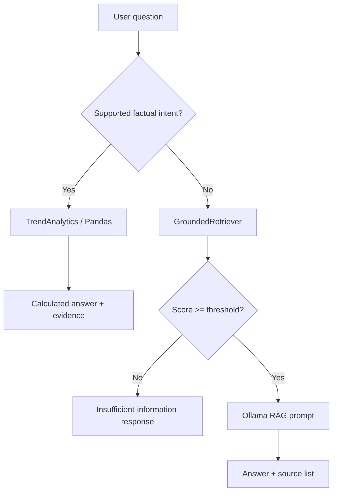

# Grounded Data Answers Design

**Spec:** `.specs/features/grounded-data-answers/spec.md`
**Status:** Approved

## Architecture Overview

The CLI constructs one analytics service from the CSV and one grounded retriever from ChromaDB. The bot routes supported fact questions to analytics; every other question uses the retriever and local Ollama chain.



## Code Reuse Analysis

### Existing Components to Leverage

| Component | Location | How to Use |
| --- | --- | --- |
| CSV path resolution | `src/config.py:resolver_caminho_csv()` | Use identical source selection for analytics and ingestion. |
| Existing Pandas dependency | `src/ingestor.py` | Add no database dependency. |
| ChromaDB and BERTimbau setup | `src/retriever.py:TrendRetriever` | Wrap scored retrieval rather than replace the vector store. |
| Local Ollama chain | `src/bot.py:TrendBot` | Preserve generation and model management. |
| CLI entry point | `main.py:main()` | Add explicit index options and construct the analytics service. |

### Integration Points

| System | Integration Method |
| --- | --- |
| CSV corpus | `TrendAnalytics` normalizes known columns at load time. |
| ChromaDB | `GroundedRetriever` gets scored semantic candidates and applies local lexical reranking. |
| Chat chain | `TrendBot.ask()` selects analytics before invoking the existing LLM chain. |

## Components

### TrendAnalytics

- **Purpose**: Normalize the local CSV and calculate supported factual results.
- **Location**: `src/analytics.py`
- **Interfaces**:
  - `answer(question: str) -> Optional[AnalyticsAnswer]` — returns a supported deterministic result or `None`.
  - `AnalyticsAnswer.render() -> str` — renders calculated result with named corpus evidence.
- **Dependencies**: Pandas and resolved CSV path.
- **Reuses**: CSV conventions in `TrendDataIngestor`.

### GroundedRetriever

- **Purpose**: Filter weak retrieval, lexically rerank candidates, and retain one chunk per video.
- **Location**: `src/retriever.py`
- **Interfaces**:
  - `invoke(question: str) -> list[Document]` — returns verified context documents only.
  - `last_sources() -> list[dict]` — exposes selected evidence for rendering.
- **Dependencies**: Existing Chroma vectorstore.
- **Reuses**: `TrendRetriever` embedding and MMR configuration.

### TrendBot routing and evidence rendering

- **Purpose**: Prefer deterministic results, otherwise generate an evidence-bearing local RAG response.
- **Location**: `src/bot.py`
- **Interfaces**:
  - `ask(question: str) -> str` — returns analytics, insufficient-information, or generated answer with sources.
- **Dependencies**: Optional `TrendAnalytics` and `GroundedRetriever`.
- **Reuses**: Existing prompt, history, and Ollama lifecycle.

## Data Models

### AnalyticsAnswer

```python
@dataclass
class AnalyticsAnswer:
    title: str
    lines: list[str]
    source_count: int
```

### Grounded Source

```python
{
    "video_id": str,
    "creator": str,
    "upload_date": str,
    "hashtags": str,
    "score": float,
}
```

## Error Handling Strategy

| Error Scenario | Handling | User Impact |
| --- | --- | --- |
| Analytics CSV missing/unreadable | Disable analytics and retain RAG | Direct data question falls through to RAG without process failure. |
| No usable values for a supported metric | Return a corpus-no-data message | No invented ranking. |
| All retrieved scores below threshold | Do not call LLM; return standard insufficient-information message | No weakly grounded answer. |
| Reindex confirmation declined | Leave vector store unchanged and exit cleanly | No accidental local data deletion. |

## Risks & Concerns

| Concern | Location | Impact | Mitigation |
| --- | --- | --- | --- |
| Initial indexing silently samples 100 rows | `main.py:61` | Answers may omit most corpus evidence. | Default to no limit and expose a development limit. |
| RAG prompt drops document metadata | `src/bot.py:58` | Claims cannot be audited. | Render concise metadata and final source list. |
| Retriever always returns nearest chunks | `src/retriever.py:58` | Out-of-domain questions can look grounded. | Use relevance threshold before context selection. |
| No RAG behavior tests | `tests/` | Regressions are not detected. | Add fixture-based tests for all feature ACs. |

## Tech Decisions

| Decision | Choice | Rationale |
| --- | --- | --- |
| Analytics engine | Pandas | Existing dependency, local, deterministic. |
| Query safety | Intent parser, not generated SQL | The exposed question set stays auditable and predictable. |
| Retrieval fusion | Semantic candidates plus lexical reranking | Improves exact-name and hashtag matching without a new service. |
